[Datadog acquired Codiga](https://www.codiga.io/blog/codiga-joins-datadog/). This repository is no longer active.

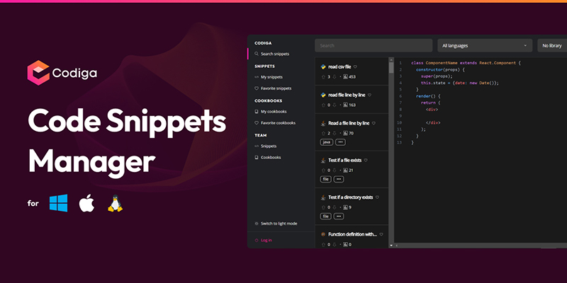

# Codiga Code Snippets Manager
### The easiest solution to search, manage and view your code snippets for Windows, MacOS and Linux.

---

| -------------------- Contents -----------------------                                   |
| --------------------------------------------------------------------------------------- |
|  -  [Install Codiga Code Snippets Manager for Windows](#win) |
| - Download Code Snippets Manager from GitHub                                            |
| - Generate an API token                                                                 |
| - Login the Code Snippets Manager                                                       |
|  -  [Install Codiga Code Snippets Manager for MacOS](#mac)   |
| - Download Code Snippets Manager from GitHub                                            |
| - Generate an API token                                                                 |
| - Login the Code Snippets Manager                                                       |
|  -  [Install Codiga Code Snippets Manager for Linux](#lin) |
| - Download Code Snippets Manager from Snapcraft.io                                      |
| - Download Code Snippets Manager from GitHub                                            |
| - Generate an API token                                                                 |
| - Login the Code Snippets Manager                                                       |

---

## Install Codiga Code Snippets Manager for Windows 

### Download Code Snippets Manager from GitHub

**Step 1**

In your browser, go to https://github.com/codiga/code-snippets-manager/releases/latest

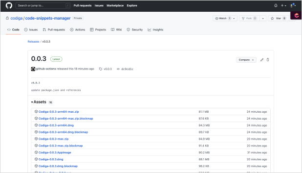

**Step 2**

Scroll down to `Codiga-Setup-<VERSION>.exe` and click to download

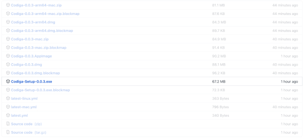

### Generate an API token

**Step 1**

In your browser, go to https://app.codiga.io/api-tokens and click on the **Create Token** button on the top right

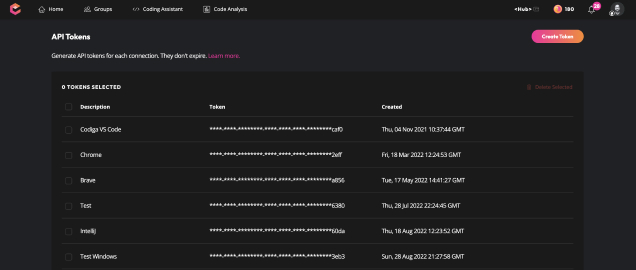

**Step 2**

Type a description name for your API token and click Create Token

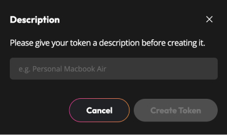

**Step 3**

Copy your new API key. **Note:** This token **will not** be displayed again.

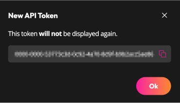

### Login the Code Snippets Manager

**Step 1**

In your computer, double click to open the downloaded file `Codiga-Setup-<VERSION>.exe` to install the Code Snippets Manager. After installed, open the app and click on Login in the top right.

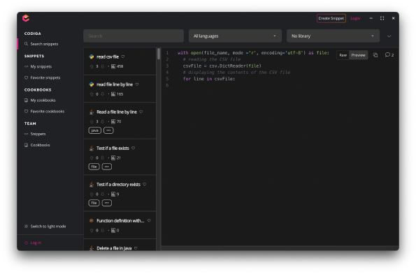

**Step 2**

In the modal, add your Codiga API Token and click on Login.

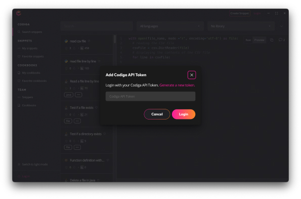

---

## Codiga Code Snippets Manager for MacOS

### Download Code Snippets Manager from GitHub 

**Step 1**

In your browser, go to https://github.com/codiga/code-snippets-manager/releases/latest

**Step 2**

a. If your Mac is Intel based, click on `Codiga-Setup-<VERSION>.dmg` to download

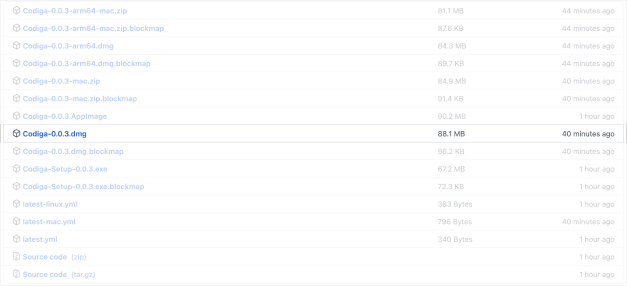

b. If your Mac is a M1 or M2, click on `Codiga-Setup-<VERSION>-arm64.dmg` to download

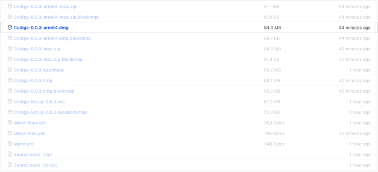

### Generate an API token

**Step 1**

In your browser, go to https://app.codiga.io/api-tokens and click on the **Create Token** button on the top right

**Step 2**

Type a description name for your API token and click Create Token

**Step 3**

Copy your new API key. **Note:** This token **will not** be displayed again.

### Login the Code Snippets Manager

**Step 1**

In your computer, double click to open the downloaded file `Codiga-Setup-<VERSION>.dmg` or `Codiga-Setup-<VERSION>-arm64.dmg` to install the Code Snippets Manager. After installed, open the app and click on Login in the top right.

**Step 2**

In the modal, add your Codiga API Token and click on Login.

---

## Codiga Code Snippets Manager for Linux 

### Download Code Snippets Manager from Snapcraft.io

**Step 1**

In your browser, go to https://snapcraft.io and search for Codiga, or click the badge below

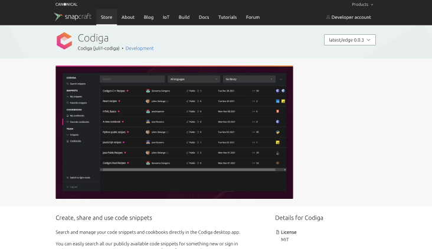

**Step 2**

Choose your Linux distribution to get detailed installation instructions. If yours is not shown, get more details on the [installing snapd documentation.](https://snapcraft.io/docs/installing-snapd)

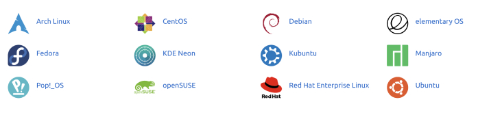

### Download Code Snippets Manager from GitHub

**Step 1**

In your browser, go to https://github.com/codiga/code-snippets-manager/releases/latest

**Step 2**

Scroll down and click on `Codiga-Setup-<VERSION>.AppImage` to download

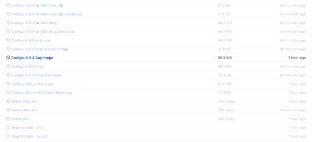

### Generate an API token

**Step 1**

In your browser, go to https://app.codiga.io/api-tokens and click on the **Create Token** button on the top right

**Step 2**

Type a description name for your API token and click Create Token

**Step 3**

Copy your new API key. **Note:** This token **will not** be displayed again.

### Login the Code Snippets Manager

**Step 1**

In your computer, double click to open the downloaded file `Codiga-Setup-0.0.3.AppImage` to install the Code Snippets Manager. After installed, open the app and click on Login in the top right.

**Step 2**

In the modal, add your Codiga API Token and click on Login.

---

## Acknowledgments

This app was built using the great [Electron React Boilerplate](https://github.com/electron-react-boilerplate/electron-react-boilerplate).

Codiga – All rights reserved 2022.
